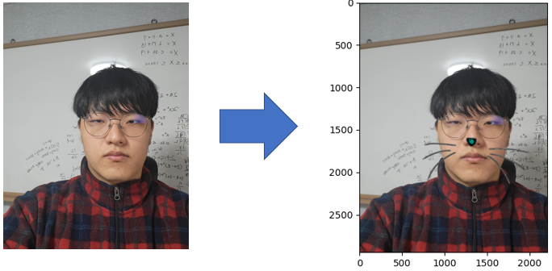

# aiffel_E03
Exploration_3, HOG(Histogram of Oriented Gradients) and ibug 300-W data set to paste stickers through real-time camera face recognition.    
AIFFEL교육과정 중 세번째 Exploration으로 HOG(Histogram of Oriented Gradients), face landmark localization 중 ibug 300-W 데이터셋을 이용하며 이미지들 변환 또는 실시간 변환

## 개요
- 이미지들 변환    
    본 시스템은 크게 4가지 단계로 이루어져 있습니다.
    1. images load    
        - /input에 있는 이미지를 가져옵니다.    
        - ../images에 있는 스티커를 가져옵니다.    
    2. HOG, SVM을 이용한 얼굴 검출    
        - dlib 모듈을 통해 얼굴 검출
    3. face landmark localization    
        - ibug 300-W 데이터셋으로 학습된 모델을 통해 이목구비 위치를 추론
    4. 스티커 적용    
        - 스티커가 이미지를 벗어나는 예외처리를 해주며, 스티커이미지 적용
    
- 웹캠    
    본 시스템은 크게 4가지 단계로 이루어져 있습니다.
    1. images load    
        - open-cv를 통해 웹캠의 실시간 이미지를 가져옵니다.    
        - ../images에 있는 스티커를 가져옵니다.    
    2. HOG, SVM을 이용한 얼굴 검출    
        - dlib 모듈을 통해 얼굴 검출
    3. face landmark localization    
        - ibug 300-W 데이터셋으로 학습된 모델을 통해 이목구비 위치를 추론
    4. 스티커 적용    
        - 스티커가 이미지를 벗어나는 예외처리를 해주며, 스티커이미지 적용

## Installation
파이썬 개발 환경으로 최신 버전의 Anaconda를 설치하세요. (Python3 버전용)
* opencv-python
* dlib
* numpy
* matplotlib

```
$ pip install -r requirements.txt
```

------------
## Directory
필수 디렉토리는 다음과 같습니다
```
.
├── images/
│   └── cat_mustache.png
├── imgs_convert/
│   ├── input/
│   ├── result/
│   ├── [E-03]imgs_convert.ipyt
│   └── [E-03]imgs_convert.py
└── webcam/
    └── [E-03]webcam.py

```
시작하기 앞서 input/ 폴더안에는 한글파일, 폴더와 상관없이 모든 이미지(.png, .PNG, .jpg, .JPG)를 인식할 수 있습니다.

------------
### result
- 이미지들 변환    


- 웹캠    


## 차별점, 문제점
1. LMS에서는 1장씩 변환을 해줬지만 여러 장을 한번에 변환할 수 있게 했습니다.
2. 양쪽 귀의 기울기를 구해 얼굴이 기울어져 있을 때 스티커가 기울어지게 했습니다.
3. system에 관계없이 인식할 수 있게 했습니다.
4. 웹캠은 60FPS로 출력되지만 성능, 처리속도가 느려 10~15FPS만 출력됩니다.
    - 이미지 1장을 처리하는데 1일 때(실제 2.8s)
        - img load: 0.038 
        - face detection: 0.956 
        - face landmark localization: 0.001 
        - imges save, print: 0.005 
    - face detection도 face landmark localization과 같이 미리 학습된 모델을 사용하면 단축
5. 웹캠에서 제대로 인식되지 않는 문제
    - face detection이 문제인지 face landmark localization이 문제인지 판단 필요
        - 얼굴인식할 때 초록색 박스가 나와야하는데 안나오는 것을 보니 face detection에 문제가 있다는 것을 알게 확인했습니다.
6. ValueError: operands could not be broadcast together with shapes (336,336,3) (331,336,3) (336,336,3)
    - 에러가 발생하는데 아마 refined가 0 이하일 때는 처리는 해줬지만, 이미지보다 크게 나올 때 예외처리를 해줘야 할 것 같습니다.
